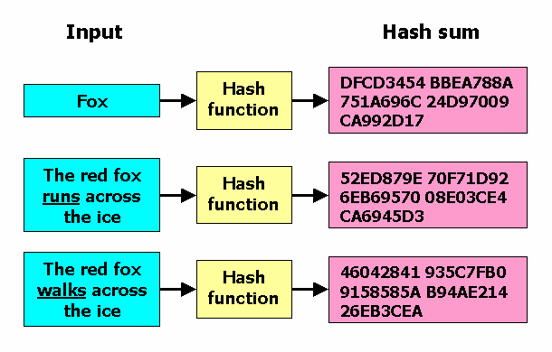
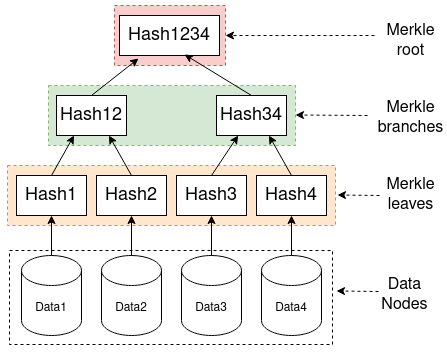

# Blockchain
with ⏳ and ❤ by [Victor Moreno Arribas](https://www.linkedin.com/in/vmorenoa) for learning purposes from the 
subject [Sistemas de Gestión de Seguridad de Sistemas de Información](https://www.ehu.eus/es/web/guest/grado-ingenieria-informatica/creditos-y-asignaturas?p_redirect=consultaAsignatura&p_cod_proceso=egr&p_anyo_acad=20220&p_ciclo=X&p_curso=4&p_cod_asignatura=26025) 
at the [Facultad de Informática](https://www.ehu.eus/es/web/guest/grado-ingenieria-informatica) in the campus of 
Gipuzkoa from the [Universidad del Pais Vasco](https://www.ehu.eus/en/web/guest/home) (UPV/EHU).

## Table of Contents
1. [Asymmetric Cryptography](#asymmetric-cryptography)
2. [SHA-256](#sha-256)
3. [Digital Signatures](#digital-signatures)
4. [Cryptographic Hash Functions](#crypto-hash)
5. [Merkle Trees](#merkle-trees)
6. [Proof of Work](#proof-of-work)
7. [Ledger](#ledger)
8. [Blockchain](#blockchain)
9. [Bitcoin](#bitcoin)

## [Blockchain example in Python](#example)


## 1. Asymmetric Cryptography <a name="asymmetric-cryptography"></a>
- *Symmetric cryptography* uses the same key for encryption and decryption.

  

[Image reference](https://www.101computing.net/symmetric-vs-asymmetric-encryption/)  

- *Asymmetric cryptography* uses two different keys for encryption and decryption.


  

[Image reference](https://www.101computing.net/symmetric-vs-asymmetric-encryption/) 

Asymmetric cryptography is a cryptographic system that uses **two different keys**: a public key and a private key.  

| Public Key | Private Key |
|------------|-------------|
| Can be shared with anyone | Should be kept secret |
| Encryption | Decryption  |
| Signing    | Verification |

### Resources
[Video by Simply Explained](https://youtu.be/AQDCe585Lnc)  
[Online key demo](https://andersbrownworth.com/blockchain/public-private-keys/keys)  
[Online RSA key generator](https://travistidwell.com/jsencrypt/demo/)

## 2. SHA-256 <a name="sha-256"></a>
SHA stands for Secure Hash Algorithm.  
SHA-256 is a cryptographic hash function that takes an input and produces a 256-bit (32-byte) hash value.  
This hash value is known as a [**message digest**](https://www.geeksforgeeks.org/message-digest-in-information-security/) (*very important*)   – typically rendered as a hexadecimal number, 64 digits (0-f) long.



[Image reference](https://www.freecodecamp.org/news/md5-vs-sha-1-vs-sha-2-which-is-the-most-secure-encryption-hash-and-how-to-check-them/)

### Resources
[SHA-256 online algorithm](https://sha256algorithm.com/)  
[Online SHA-256 generator](https://emn178.github.io/online-tools/sha256.html)  
[Steps in SHA-256](https://www.educative.io/answers/what-are-the-different-steps-in-sha-256)  
[Video by Xiuminseokie21](youtube.com/watch?v=9xs4eWOAG7Y)

## 3. Digital Signatures <a name="digital-signatures"></a>
A digital signature is a mathematical scheme for verifying the authenticity of a digital message or document.


#### Signing
**Input**: message, private key  
**Output**: signature

#### Verification
**Input**: message, signature, public key  
**Output**: true/false


[Image reference](https://medium.com/@rohanassurvase/a-guide-to-understanding-digital-signatures-what-is-it-and-how-it-works-5f50e5962168)

### Characteristics of a good digital signature
- **Authentication**: Digital signature makes the receiver believe that the data was created and sent by the claimed user.
- **Non-Repudiation**: The sender cannot deny sending a message later on.
- **Integrity**: This ensures that the message was not altered during the transfer.
### Resources
[Video by khan Academy](https://youtu.be/Aq3a-_O2NcI)  
[Video by Lisk](https://youtu.be/JR4_RBb8A9Q)  
[Video by Computerphile](https://youtu.be/s22eJ1eVLTU)  
[Medium article](https://medium.com/@rohanassurvase/a-guide-to-understanding-digital-signatures-what-is-it-and-how-it-works-5f50e5962168)  
[Book for dummies](https://www.cryptomathic.com/hubfs/Documents/E-Books/Digital_Signatures_for_Dummies.pdf)  


## 4. Cryptographic Hash Functions <a name="crypto-hash"></a>
This are a special class of hash functions that have certain properties that make them suitable for cryptography.

### Characteristics of cryptographic hash functions:
- **Deterministic**: the same input always produces the same output.
- **One-way**: it is infeasible to compute the input data from its hash value.
- **Collision resistant**: it is infeasible to find two different inputs that produce the same hash value.
- **Computationally efficient**: it is easy to compute the hash value for any given input data.
- **Hide information**: the output looks random and does not reveal any information about the input data.


### Resources
[Video by Lisk](https://youtu.be/2BldESGZKB8)  
[What is hashing?](https://www.educative.io/answers/what-is-hashing)  
[Video by Khan Academy](https://youtu.be/0WiTaBI82Mc)  
[Online SHA-256 hash demo](https://andersbrownworth.com/blockchain/hash)  
[Cryptographic vs Non-crpytographic](https://dadario.com.br/cryptographic-and-non-cryptographic-hash-functions/)  
[Video by 3Blue1Brown](https://youtu.be/bBC-nXj3Ng4?t=747)

## 5. Merkle Trees <a name="merkle-trees"></a>
A Merkle tree is a data structure that allows for efficient verification of the contents of large data structures.  
It is a tree in which every leaf node is labelled with the cryptographic hash of a data block and every non-leaf   
node is labelled with the cryptographic hash of the labels of its child nodes.

  

[Image reference](https://medium.com/coinmonks/merkle-trees-concepts-and-use-cases-5da873702318)

### Resources
[Intro to Merkle Trees](https://academy.binance.com/es/articles/merkle-trees-and-merkle-roots-explained)  
[Video by Cryptoeconomic Study](https://youtu.be/r_vrvoGd3RU)

## 6. Proof of Work <a name="proof-of-work"></a>
Proof of work is a piece of data which is difficult (costly, time-consuming) to produce but easy for others to verify.  
This piece of data needs to comply a set of rules that are difficult to satisfy but easy to verify.

Bitcoin uses the proof of work algorithm to determine the order of transactions in the blockchain.
Etherium uses the proof of stake algorithm to determine the order of transactions in the blockchain.  

  

[Image reference](https://forkast.news/proof-of-work-what-is-it-bitcoin-halving/)

### Resources
[Video by Binance Academy](https://youtu.be/3EUAcxhuoU4)  
[PoW by Investopedia](https://www.investopedia.com/terms/p/proof-work.asp)  
[Video by Khan Academy](https://youtu.be/9V1bipPkCTU)  
[PoW vs PoS](https://blockgeeks.com/guides/proof-of-work-vs-proof-of-stake/)  

## 7. Ledger <a name="ledger"></a>
A ledger is a record of transactions.
This is the key element to keep the integrity of the blockchain.


[Image reference](https://www.bbc.com/news/technology-32781244)

The ledger is distributed all over the network and it is updated by the nodes.  
If one node changes the ledger, in the following step it will be verified and just with a single bit been modified 
the hash will be completely different and the block will be rejected.  
The rest of the nodes still have an updated ledger that is valid.

### Resources
[Online demo ledger](https://andersbrownworth.com/blockchain/distributed)  
[Video by Sonar Systems](https://youtu.be/OBSBu3afgeE)  
[Video by Genesis Block HK](https://youtu.be/4b0A5XU3-tY)  
[Video by Anders Brownworth](https://youtu.be/_160oMzblY8)

## 8. Blockchain <a name="blockchain"></a>
A blockchain is a distributed ledger that is used to record transactions across many computers so that the  
record cannot be altered retroactively without the alteration of all subsequent blocks and the collusion of the network.

Blockchain is a combination of all the concepts we have explained above.  


[Image reference](https://www.velotio.com/engineering-blog/introduction-to-blockchain-and-how-bitcoin-works)

### Resources
[Video by 3Blue1Brown](https://youtu.be/bBC-nXj3Ng4)  
[Video by Anders Brownworth](https://youtu.be/xIDL_akeras)  
[Video by Simply Explained](https://youtu.be/SSo_EIwHSd4)

## 9. Bitcoin <a name="bitcoin"></a>
Bitcoin is the first cryptocurrency and the most popular one.


[Image reference](https://www.statista.com/statistics/647523/worldwide-bitcoin-blockchain-size/)


### Resources
[Khan Academy Course](https://www.khanacademy.org/economics-finance-domain/core-finance/money-and-banking#bitcoin)

# Blockchain examples <a name="example"></a>
### Hasher
First of all, we need a method to get the hash digest in SHA-256 of any content from a file.
```python
import hashlib

# Generates the hash for a given filename
def hasher(file):
    with open(file, "rb") as f:
        bytes = f.read()  # read entire file as bytes
    return hashlib.sha256(bytes).hexdigest()
```

#### Example
Run [hasher.py](testing/hasher.py) to get the hash digest of a file.


### Signer
Secondly, we need a method that signs the block with a private key (8 HEX characters) and a public key (G39).
```python
import secrets

# Sign the file with an 8-len HEX string and a signature
def signer(file, signature):
    f = open(file, "a")
    sign = secrets.token_hex(4) + " " + signature
    f.write(sign + "\n")
    f.close()
    return sign
```

### 

